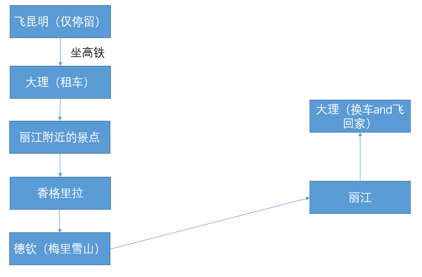
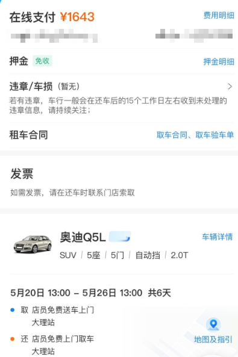
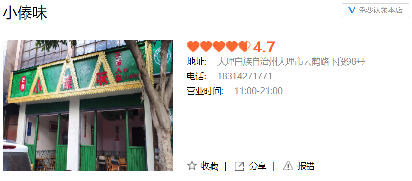
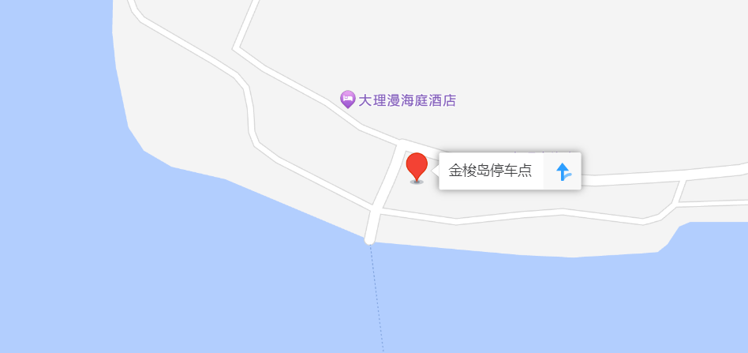
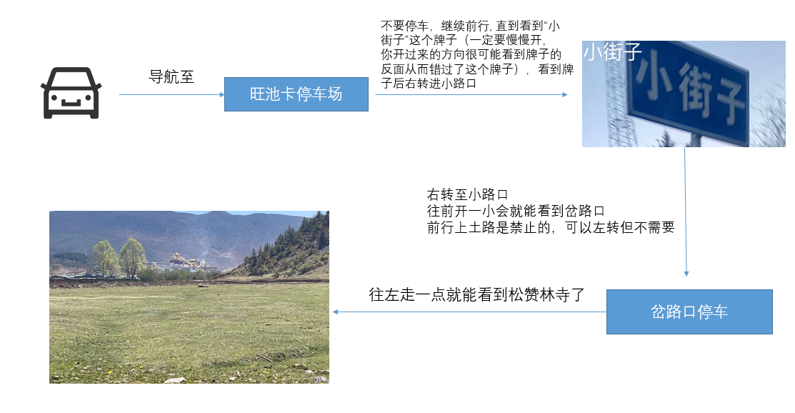
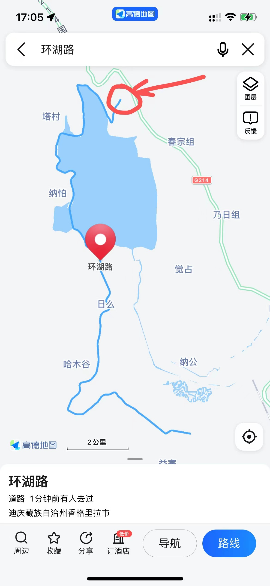
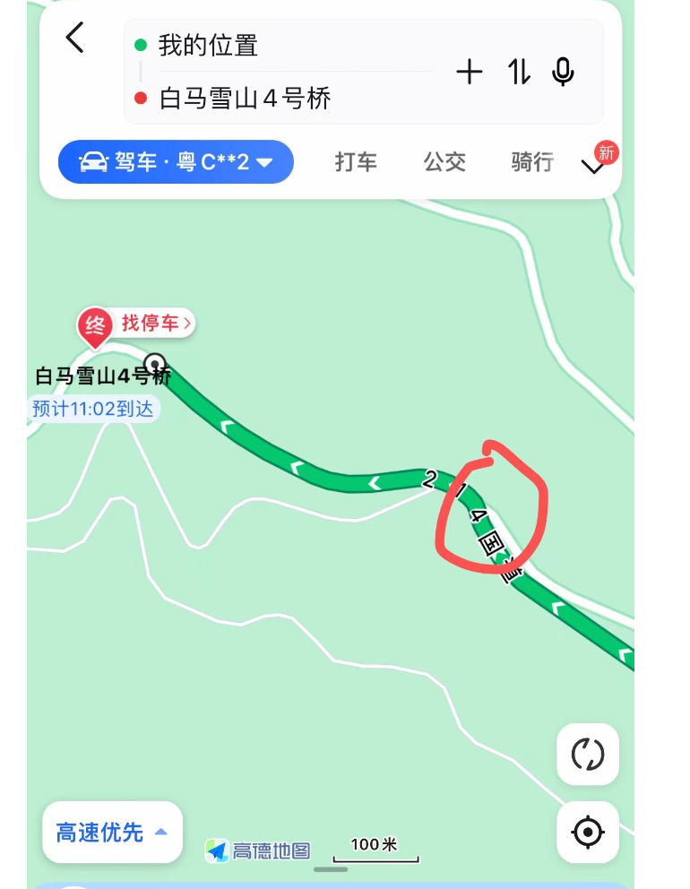
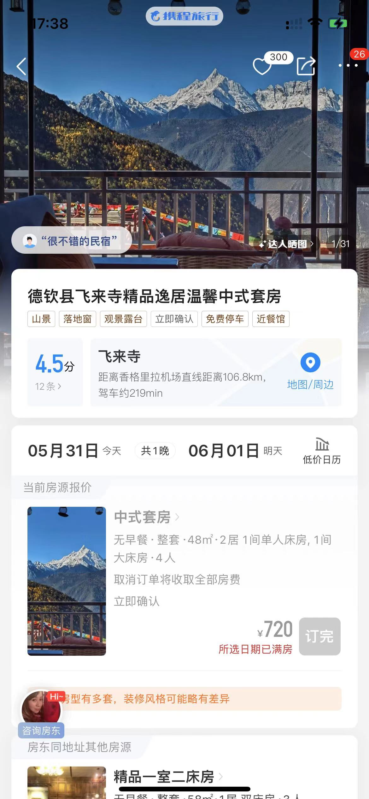

## 云南

### 一、出行准备

1. 身份证
2. 羽绒服
3. 肠胃药（氧气瓶可以到了再买）
4. 高原药（高原维能，红景天，葡萄糖等），我个人认为高原维能带1瓶足够，葡萄糖可以买多几瓶，这个便宜

5. 唇膏，防晒，补水的产品（建议平时不护肤的也带上，不然最后黑成碳）

### 二、计划概述

我们这次去的方式是自驾游，在大理租的车，这部分内容后面详细讲下。

大概的路线如下

### 三、关于租车

租车的话，推荐直接在携程租车，然后可以利用支付宝的芝麻信用分免押。

​        

我们租了一台奥迪Q5L，总价钱为1643 + 800（保险） = 2443，一共6天，如图

> 几个细节注意一下
>
> - 保险方面：平台的保险只保1500块以上的问题，1500块以下小剐小蹭的不保，我问了几个本地人和做租车这行的人，都说建议跟他私下买1500以下小剐小蹭的保险，不然有可能坑惨你，这个直接找客服就行，（一般来说是100一天，由于我们的是新车，所以收了我们800六天），因此租车的费用是1643+800=2443。
> - 时间方面：租车的时间最好是像我这样，完整的6天，不然多一个小时都会算多你一天的价格
> - 车况方面：拿到车的时候，用视频拍一下车的各个部位，并且拍车的剩余油量，拍完之后第一时间发给租车给你的那个人
> - 查车方面：建议背一下行驶证上驾驶人的姓名，因为如果在大理租的车，实际上是不能开到香格里拉的，到时候万一被查了，就说是朋友开的车就行。

### 四、计划内容

#### 1. 第一天（昆明），住：昆明机场

坐晚上的飞机然后凌晨到昆明，提前在携程订好机场附近的酒店（注意需要找能接机的酒店）

#### 2. 第二天（大理），住：才村码头

##### 租车

坐高铁到大理，中午找了个傣族餐厅`小傣味`，就在高铁站附近，但是记得需要13:00之前到，不然人家中午打烊了，最好打电话提前预约。

##### 才村码头

出发去才村码头，到了应该差不多是下午了，然后在才村附近找客栈租房，可以平台租可以直接当地找，自行对比后再租，一般200以下的价位比较合理。

##### 生态廊道

租生态廊道里面的景区电动车，可以环一下洱海，但是注意下景区的电动车在8点的时候平台就不给租了，而且我也建议下午时候骑电动车，因为傍晚或者晚上的时候会有一堆飞虫拼命敲击你的脸庞，并且晚上没有灯也看不到什么景色。到傍晚的时候可以回到码头看看日落拍拍照。

##### 大理古城

吃完饭可以去逛一下，离才村码头就10分钟

#### 3. 第三天（环洱海），住：才村码头

##### 金梭岛

上午出发金梭岛，这个岛比较小众，需要坐船上去，如果直接自驾会绕很远。听说以前南朝王在这建的夏宫，用来避暑。导航金梭岛停车点，然后不同船有不同船的售票点

> ps：但是个人感觉，岛上好像没什么逛的，里面有个景点叫龙宫，门票好像需要将近300，然后岛上卖的东西如出一辙，建议小红书先预览下再决定要不要去

##### 双廊古镇

到双廊古镇已经差不多是中午了，可以去吃一个景点里面的白族餐厅——`南枝·花上花白族庭院餐厅`，吃饱可以逛一逛古镇。

> ps：如果上午不去金梭岛，可以考虑直接去双廊古镇的月亮宫，太阳宫，这个需要预约的，并且只能预约上午。下午时段不用预约，但是要收费了，128一位。

##### 喜洲古镇

这里有网红的转角楼，还是刘亦菲主演的《去有风的地方》取景地。可以拍拍照逛逛古镇。并且有个冰棍店很好吃——`清凉小屋`

##### 海舌生态公园

去完古镇可以去这里，我们当时没去成，因为没开放

##### 龙龛码头

此时已经是傍晚了，可以去龙龛码头逛一下，这实际上也是属于生态廊道，如果不想去的话可以直接回才村了

##### 挖色菜香园

吃晚饭

##### 大理古城

吃完饭又可以去逛一下

#### 4. 第四天（丽江-香格里拉），住： 独克宗古城

##### 虎跳峡

早上出发，导航虎跳峡停车场，好像是哪个停车场都行，因为到了景点后会有人拦住你，让你买票先你才能继续往前开。

##### 虎跳峡镇

中午在镇上吃个饭就行，可以试下当地的野菜

##### 普达措国家公园

##### 独克宗古城

先在附近找个客栈，我们当时住的是`云丹别院`，还不错的，可以先导航到这里，然后再找几个附近的客栈对比下，再选择住哪家

这里有个`大佛寺转经筒`， 挺出名的一个景点，去完这里的时候应该已经快晚上了，可以在`老字号特色藏餐`吃饭，直接在美团点个套餐就行（酥油茶建议喝甜的），注意一定要提前问套餐券是不是可以用，独克宗有很多写着‘老字号xxx’的店，不要进错了。

> 独克宗古城实际上在2014年1月11日发生过一场很大的火灾，整个古城都快烧没了，所以我们现在看到的，都已经是新的了。

在独克宗还有一方净土`世华湘蒙`，有两个区域，一个是店主的画廊；一个是店主的故事馆，这里讲述了店主（名叫蒙古）和他的妻子阿娇在云南的故事（包括他们在云南的生活、独克宗古城的火灾等）

#### 5. 第五天（香格里拉），住：巴拉格宗水庄大酒店

##### 松赞林寺

松赞林寺的话，我们并没有去到景区，第一个是贵，第二个是要爬，考虑到身边的人高反不适，最终决定没有去。

但是，毕竟是“小布达拉宫”，来都来了，总得看看吧。

于是我们找到了以下路线：

- 纳帕海

切记，环`纳帕海`不要直接导航纳帕海`纳帕海`，正确的方法应该是导航环湖路，然后一般是从我画的这个点开始环纳帕海。

##### 巴格拉宗

进巴格拉宗景区建议让老一点的司机开车，因为里面的弯道多、路有时候也窄。新手开也没关系，慢点就行。

建议提前订好巴格拉宗的水庄大酒店，这个是景区内部的酒店，包含停车的，并且环境也不错，可以看景（不过能看景的房子晚上会有水流声，睡眠质量差的朋友注意）。

停车时会有个保安过来找你登记，并且告诉你景区什么时候发车，在售票处买完票后即可进入景区（好像网上买会便宜几块钱）

> 关于景区内的大巴：该景区有4个景点，都是通过景区大巴前往的，每次前往下个景区的大巴可能会更换，因此每次下车记得带好自己行李。

#### 6. 第六天，住：飞来寺

##### 白马雪山机位

导航`白马雪山4号桥`, 在目的地之前有一个上坡的岔路（如下图所示），拐上去，往前开几百米就到了，或者可以一直开到你觉得适合拍照的机位

##### 浓雾顶观景台

这个观景点是看梅里雪山，直接导航去即可。

##### 飞来寺民宿（导航：德钦飞来寺精品逸居）

飞来寺的民宿我只推荐这家，这家经过我们实地考察确实是能看到梅里雪山的，观景台位于他们家4楼。

##### 卡瓦博格峰观景点

这一天比较自由，可以去周围逛一逛，如果没什么地方去，可以尝试去这个观景点看看，离民宿开车也就10分钟的事情。

#### 7. 第七天，住：丽江古城（古城外围）

##### 束河古镇

这个由于时间原因，我们没有去。但是这个会比白沙古镇近些。

##### 白沙古镇

白沙古镇好像没有逛到什么好玩的，吃了`馒头诗人`的鲜花馒头，没有什么特别的。然后这里会有个比较出名的`冰箱贴`，小红书也能搜到，但是我们也没有买，就看了下。

##### 丽江千古情

看丽江千古情，如果想买VIP票（建议选择VIP票，因为和普通票相比差不了多少），一定要提前一天买票，最好能找到人私下买，可以试着问问丽江这边的客栈老板什么的，我们买的是260的VIP票，但实际上还有人能200买到。

场次有三个:

- 14:00 - 15:00
- 16:30 - 17:30
- 19:30 - 20:30

> 但是个人建议啊，这个演出我个人认为200这个价位并不是很值得，千古情有4个章节，只有最后一个章节的表演我才觉得有技术一些，有高难度的托举和绚丽的灯光效果，其他的我感觉比较一般，舞不是很齐，有些演员没有很跟音乐，不过大型道具倒是用的挺多。
>
> ps：适合带家人一起去看

#### 8. 第八天

换车 -> 坐飞机回家

### 五、总结

1. 你也许会发现，丽江我们是安排在返程时才去的，其实更合理的方式是大理 -> 丽江 -> 香格里拉 -> 德钦。我们只是为了不想一下子返程，所以选择了丽江中间停留点。
2. 一定要看好天气，蓝天白云的洱海看起来才会更美，梅里雪山没有多云时才能看到日照金山。
3. 如果有需要补充或相关意见的，请留言，文档将一直持续更新。

