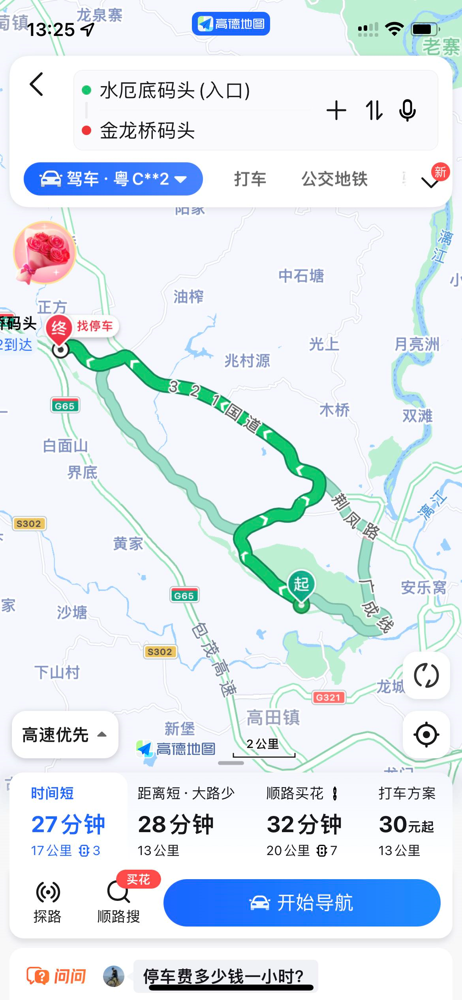
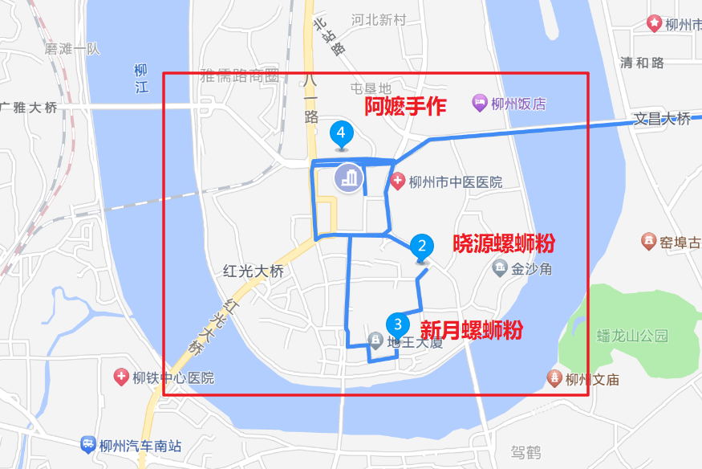
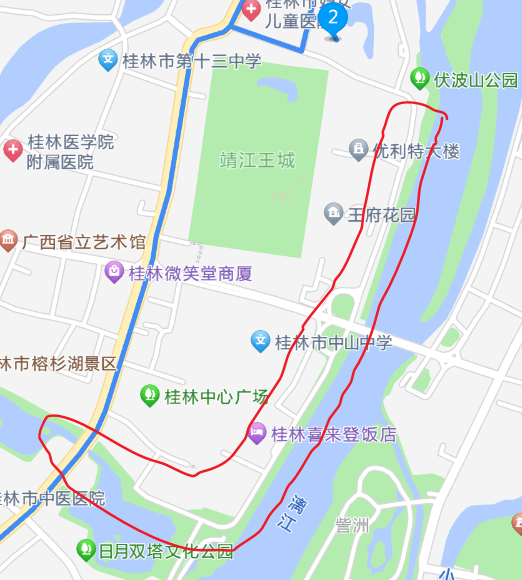
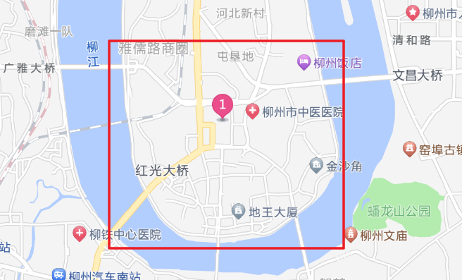

## 柳州-阳朔-龙脊梯田

游玩时间 : 4天3夜

方式 : 推荐自驾游

ps : 由于仅四天三夜, 时间比较赶, 因此主要选择了三个比较有特色的地方. 舍弃了南宁和桂林市区, 因为两者的景点不太多, 个人认为去的青秀山和象鼻山都有点踩坑. 倒是如果有多的时间可以选择在南宁停留一下, 吃一吃柠檬鸭和老友粉.

### Day1

自驾游可选择前一晚上到达或者第一天的中午到达

> 注意看Day2的路线, 在早上9:00 - 12:00的时间段先询问好遇龙河在这个时间段是否多人, 排队需要多久, 为明天的路线制定做好准备, 因为不同码头之间的距离相差比较远的, 如图
>
> 

1. 住宿地点推荐红框内(柳州市人民广场附近), 因为比较出名的螺蛳粉和小吃都集中在这一块

2. 入住登记后, 可在附近吃`晓源螺蛳粉`和`新月螺蛳粉` (其他螺蛳粉自行探索, 这一块有很多), 然后找一找附近最近的`阿嬷手作`

3. 柳州市区个人感觉没有什么景点, 因此可以出发去阳朔西街了

4. 西街的酒店登记入住后, 出发去`佬张漓江啤酒鱼`

> 我不推荐大师傅啤酒鱼, 又贵又一般, 而且我吃的还是总店. 

5. 吃完逛一逛西街就差不多可以回去了

6. 这天晚上还需要去携程搜"遇龙河竹筏漂流", 然后买

### Day2

1. 第二天一早, `何姐石磨肠粉`吃个早餐, 然后出发`遇龙河竹筏漂流`

> 遇龙河漂流注意事项 : 
>
> - 提前买好鞋套, 随便买个一次性的便宜的就行, 注意实际上是不给你带鞋套的, 但是鞋子确实会进水, 因此把鞋套放进口袋或者包包里(包包可以带), 等上到竹筏坐好后, 再穿上就行, 因为本人亲测确实会湿鞋底
>
> - 路段推荐
>
>   - 路线一 : `金龙桥-旧县` 电话 : 15807836201
>   - 路线二 : `水厄底-万景` 电话 : 15807836003
>
>   区别是第一个是网红路线(首选), 所以旺季时候必然有很多人排队, 甚至出现早上9-10点就把票卖空的情况. 这时候可以选择备用方案路线二
>
>   ps : 建议去漂流的前一天早上时间段询问人流量是否多, 排队需要等多久, 在Day1有说
>
> - 在开车去景区的路上, 会有一堆阿姨骑着电动车追着你告诉你去哪里停车, 或者带你去别的景区. 不要理她们

2. 漂流到终点后, 这两条路线是有接驳车返回到出发点的, 因此不用担心离停车距离太远的问题(其他路线并未验证), 接驳车需要买票, 这个自己找找售票处, 然后问返回自己所在码头是怎么坐车, 票价不贵

3. 出发`遇窖记私房菜馆`, 吃个烧鸡和竹筒饭, 或者看小红书招牌菜是什么

4. 出发兴坪古镇, 20元人民币打卡点在此处, 停好车后询问路人或相关工作人员怎么走即可

5. 打完卡去往相公山附近的住宿

> 若不考虑去如意峰, 那就直接在相公山附近订住宿吧

### Day3

1. 吃个早餐, 出发相公山 (可看日出)

2. 中午午饭随意

3. 下午前往桂林市区的`新郭记油茶(八角塘店)`, 吃金丝饼, 其他可以不点, 我个人觉得其他不好吃, 包括油茶

> 记得这个是下午17:30才营业, 别去早了

4. 然后没吃饱可以在`东西巷`找点吃的, 晚上游一游两江四湖, 骑行or步行即可

5. 前往龙脊梯田

### Day4

1. 龙脊梯田景区 (询问大寨老板怎么逛, 好像还有温泉可以泡, 但是没必要)

2. 逛完就可以回城了

### 住宿推荐

- Day1住柳州人民广场附近

- Day2住相公山景区附近
- Day3住龙脊梯田金坑大寨