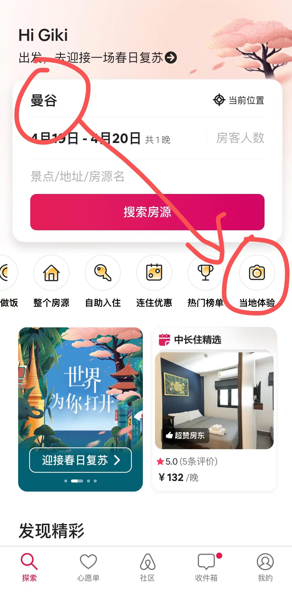
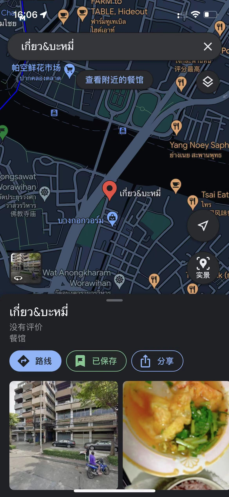

## 泰国

### 一、出行准备

1. 淘宝买一张电话卡
2. 护照
3. 打印酒店，机票的行程单，海关或值机可能用到
4. 签证
   - 落地签（实际上人感觉并不是很多）
   - e-visa (省钱，但是出签效率时快时慢，我在出行前一天才下签， 但是便宜)
   - 淘宝找人代签
5. 泰铢（我没有被检查）
   - 如果一人去：带个10000泰铢现金估计也可以
   - 如果以家人去：带个20000泰铢现金

6. 下载好APP
   - airbnb（订民宿）
   - 打车软件：grab（绑定国内银联卡），bolt（用现金），indrive（用现金）
   - google 翻译（虽然感觉不是很准，但是够用就行）
7. 游泳套装（泳衣沙滩裤，手机防水袋，泳镜）
8. 肠胃药

### 二、计划概述

​	首先声明一下，因为我是一个人旅游，所以本篇计划比较适用于一个人。比如交通问题，我全程都是用软件打摩托车，摩托车只能载一个人，很方便，去哪都便宜。、

​	我做攻略的步骤是先大概在小红书游览下有什么景点，再去咸鱼那边花钱找当地的留学学生咨询。然后开始在PPT记录每一天的大致行程，最好是多安排几个景点，到时候万一时间多出来不至于没有目标。

​	我的计划大致分为9天8晚，2天芭提雅，2天西昌岛，4天半曼谷，还有半天留着赶去坐飞机。

### 三、计划内容

#### 1. 第一天（芭提雅）

##### 1.1 机场打车到芭提雅

我是在廊曼机场打车的，廊曼没有到芭提雅的巴士，听说只有素万那普机场有。为了节约时间，直接打车（注意打车的高速费是需要自理的，司机会问你上不上高速），但是建议还是上高速，比较花不了多少钱。打车如果无法和司机沟通，可以找机场的工作人员帮忙。

##### 1.2 check-in + 吃饭

在民宿check-in（登记）后，就在附近的沙滩闲逛下，然后找个餐厅吃个晚餐，芭提雅有很多靠海边可以看日落的西餐厅，可以挑一个随便吃点。我去的是`the factory chocolalte`，一般般，但是招牌巧克力甜品还可以。

##### 1.3 79 成人秀

开放时间：19:00 - 20:30入场（每一个小时一个循环，所以不用担心入场时间一定要准时的问题）

18禁！！但是确实大开眼界，不介意低俗的内容可以去试试，买票的话可以在淘宝买，我买的时候找一个微信代买才160一张（这就是信息差距，别人都是至少240RMB买的，我认识一个花了400买）。看完时间也不早了，如果担心安全问题，可以打车回酒店休息了。

#### 2. 第二天（芭提雅）

##### 2.1 格兰岛

这个是淘宝报团参加的，记得看看有没有酒店接送。可以报多点项目，价格不会差太远，不然的话你就只能在那里干等。记得涂好防晒！！切记！！泰国的太阳真的很毒

##### 2.2 芭提雅步行街

可以晚上的时候去看看，走一走。看看“她们”是怎么揽客的

#### 3. 第三天-第四天（西昌岛）

简单说一下为什么会选择这个岛吧，这个我也是问当地的大学生问到的，这个岛还没有开始开发成旅游景点，所以岛上的人民基本上全是泰国人，至少我去的时候，不要说中国人了，外国人都没见到过。所以能感受到真正的当地风情，而且到处都很安静，不会人挤人。

1. 第三天一大早，打车到去西昌岛的码头

> - 一般来说，打车软件搜英文名和中文名都可以搜到，这两个换着来用。如果两种语言都搜不到，那就现在google map中搜到这个位置，然后复制泰文到打车软件
> - 记得提前联系airbnb的民宿房东，叫他来接你，一般都会有接送

2. 然后找到这个地方买票， 只能现金。

> 候船时间：假设买了10:00的票，那么9:50的时候在那里等就行。

3. 船程约为 40分钟，毕竟比较远，下船后跟房东联系，然后check-in，我住的房子长这样↓，大概250RMB一晚上

4. 岛上有12个主要的景点，每个景点都会有一个路标。岛比较小，其实一天就能够逛完

5. 上岛后看看房东租不租摩托车，租的话直接找房东租就行，当时我租了两天，一共400泰铢

6. 岛上的餐厅比较少，我也不知道哪个好吃，如果比较介意卫生方面的问题，可以去这家西餐厅`ใบไม้บ้านกาแฟ@สีชัง`，我在岛上吃饭全在这解决的

#### 4. 第五天（曼谷）

先在西昌岛check-out，坐最早的一班船6:30离开西昌岛（注意，只有最早的一班船的班次不是整点的，第二班船就是从8:00开始了），然后打车到青旅check-in，分享下我的青旅

> 如果第六天打算去RONGROS或Supanniga Eating Room, Tha Tien吃东西（挑一家即可），那么记得在今天预约。当天是预约不到的，因为明天的计划里面是有这一项的， 但是我当时不知道要预约所以没吃上。

##### 4.1 siam商圈

这实际上是一个大商圈，主要分为五个部分：Siam paragon（暹罗百丽宫），Siam Center（暹罗中心），Siam Square（暹罗广场），MBK Center，曼谷文化艺术中心。

##### 4.2 四面佛

这个地方，感觉好像没啥好去的，就一个四面佛，这个四面佛其实很多地方都有这个雕像，不一定要去这里。

##### 4.3 朱拉隆功大学（吃午饭）

- 蟹肉滑蛋饭（7分）

  营业时间：8:00 - 19:00

  位置：朱拉隆功大学50巷

  

  

- Jae Wan-lisa同款甜品（7分）

  营业时间：13:00 - 23:30

  位置：Jae Wan

  

  

  

这个奶确实还可以，白色的汤圆有点难吃。

##### 4.4 伦披尼公园

公园挺大的，可以到处逛逛，还有大蜥蜴。

> 我还遇到了个泰国的声乐老师，还合作弹唱了一首Love yourself ^_^。`https://youtu.be/iPklFMjWwGw`

##### 4.5 皇权像素大厦

这个地方实际上是看日落和夜景的，在上面视野很开阔，你可以看到整个曼谷建议5:00 - 6:00到，只能逛74楼-78楼，注意一下去就不能再上来了，所以要慎重。门票大概1000泰铢。

##### 4.6 暹罗天地

也是一个商圈，但是我对商圈没太大感觉，毕竟不买东西，所以随便逛一下就出来了

##### 4.7 摩天轮夜市（码头夜市）

营业时间：11:00 - 0:00

位置：码头夜市

#### 5. 第六天（曼谷）

##### 5.1 大皇宫

ps：今天可以睡晚点，毕竟没什么安排，10点或者11点到就行，因为下一站就直接吃午餐了，午餐营业时间从11点开始

营业时间：8:30 - 15:30

##### 5.2 RONGROS 或 Supanniga Eating Room(午餐)

这里要预约的，前一天攻略有说，两家餐厅挨得很近

营业时间：11:00 开始营业（RONGROS是15:00 结束营业，然后下午17:00才恢复营业的，要注意下）

位置 ： 

##### 5.3 郑王庙

在这个码头坐船到对岸，只需要10泰铢

坐到对岸一下船就是郑王庙了。

##### 5.4 曼谷骑行

这是一个airbnb的活动，非常火爆，大致是带你骑单车，然后英文讲解一些泰国的文化，并且带你去吃真正的当地小吃，确实挺好吃的，自己绝对找不到这些地方。

> 如果觉得贵了不想去， 也可以自己去找这几家餐厅，有些有定位有些没定位，我记录了大部分，有几家已经忘了
>
> 
>
> 
>
> 

##### 5.5 唐人街

营业时间：24小时

位置：唐人街

> 都是吃东西的，人是真**的多

#### 6. 第七天（曼谷）

> 注意，这天的旅程必须安排在周五-周日，因为其他时间不开门，所以在曼谷这5天的顺序是可以调换的。

##### 6.1 美功铁道市场

营业时间：8:00 - 19:00

位置：

##### 6.2 安帕瓦水上市场

营业时间：10:00 - 21:30（周五-周日）

位置：

##### 6.3 JODD FAIR（网红火车夜市）

营业时间：16:00 - 0:00

位置：

美丽的水果西施就在这里，火山排骨不要去吃了，都在避雷，剩下的就随便逛逛吧，还挺大。

#### 7. 第八天（曼谷）

> 注意，这天的旅程必须安排在周六-周日，因为其他时间不开门，所以在曼谷这5天的顺序是可以调换的。

##### 7.1 Bang nam水上市场

营业时间：7:30 - 16:00（周六周日）

位置：

##### 7.2 暹罗古城

营业时间：9:00 - 18:00

##### 7.3 Bang Pu Recreation Center

这个地方应该都是本地人知道，主要是喂海鸥，看日落的。所以建议接近日落时分（17:00）到达。

> 记得带好防护措施，湿巾啊，帽子什么的，万一海鸥拉屎到你身上，你还可以处理。

##### 7.4 席琳卡娜火车夜市

营业时间：17:00 - 1:00（周四-周日）

位置：

#### 8. 第九天（曼谷）

这一天其实基本上已经玩的比较累了，可以挑一个附近的商圈或者水上市场，买买手信逛逛街就行了。

### 四、注意事项

这里面我只说我觉得要注意的东西，其他注意事项可以直接小红书搜索

1. 打车的话，没有哪个软件是最便宜的。grab,bolt,indrive三家自行对比，其实一般短途只需要用前两家就行，长途就三家一起对比。还有高速费的话，是你出的，司机会问你上不上高速。打车前一定要备好散钱！！
2. 小费的话，我是没给的。我遇到的泰国人都挺好的，不会给你脸色什么的，除非是那种用现金打车发现自己找不开。比如还差几泰铢什么的（也就rmb不到一块钱），那直接让他不用找了，你在泰国就知道，开摩托车赚钱是真不容易。
3. airbnb当地文化活动，这个其实相当于跟本地的团了，但是这些团都不会坑人的，至少我遇到的没有。有做瑜伽，学泰餐，学泰拳，曼谷骑行等等之类的活动。

> 我去美功铁道市场和安帕瓦水上市场其实就是跟了这里面的团，也就200块钱，相当于给了交通费而已。所以挺好的，还有酒店接送的。

4. 一个人旅游的话，完全不需要考虑交通问题，直接无脑用打车软件坐摩托车（不是突突车），人多的话，可能要考虑bts或者天轨了，这个没去了解。

5. 喝椰子水的话，我建议买那种小的椰子会好喝点，会甜一点

6. 我的行程计划里面没有提到马杀鸡，因为这个时间是比较自由的，没有特地穿插，可以在小红书找几个网红店然后去试试。我觉得按的还可以的就`arunda`，`静diora`。

   > 马杀鸡基本上都是要提前一天以上预约的，一定要记住（arunda不用，现场排队的）

7. 安全问题的话，说实话，真的觉得还好，可能因为我是男生吧。举个例子，我在全是泰国人的小岛待了2天，也没啥事。在芭提雅步行街，晚上待到1点钟，也没事。

   > 但是如果你喜欢去酒吧，就要注意了，我有个朋友去一个成人酒吧，虽然没被坑，但是服务员过来送了他一点点K粉，旁边的老外还在怂恿他吸。然后他被吓跑了。所以酒吧和大麻店不要去就行。